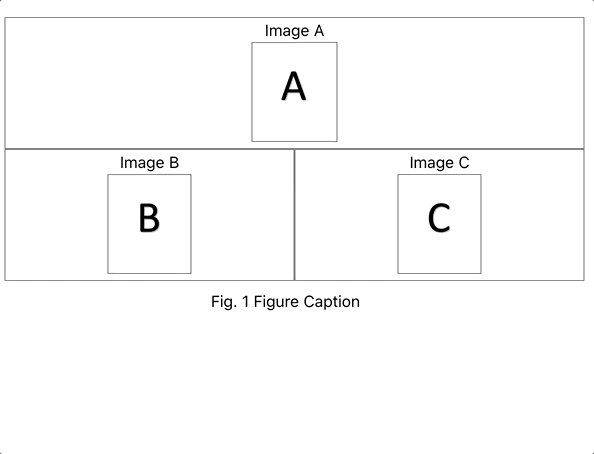

# sphinx-subfigure

[![PyPI][pypi-badge]][pypi-link]

A [sphinx](https://www.sphinx-doc.org) extension to create figures with multiple images:

- Provides a simple format for complex image layouts.
- Supports HTML fully, with responsive layouts, for different screen sizes
  - LaTeX is supported, except for images that span multiple rows.
  - degrades gracefully for other formats.
- Supports figure numbering and referencing.
- Supports image sub-captions, via `alt` text.

## Usage

Install `sphinx-subfigure` with `pip install sphinx-subfigure`,
then add `sphinx_subfigure` to your `conf.py` file's `extensions` variable:

```python
extensions = ["sphinx_subfigure"]

numfig = True  # optional
```

Now add a `subfigure` directive to your document:

```restructuredtext
.. subfigure:: AA|BC
   :layout-sm: A|B|C
   :subcaptions: above
   :name: myfigure
   :class-grid: outline

   .. image:: imageA.png
      :alt: Image A

   .. image:: imageB.png
      :alt: Image B

   .. image:: imageC.png
      :alt: Image C

    Figure Caption
```

1. Each image is automatically assigned an *area identifier* (A, B, C, etc.).
2. Layouts are formed by composing the areas into a grid, with rows delimited by `|`.
3. Each area must be used exactly once in the layout, and form a single rectangle.
4. "Empty" areas can be designated with `.`
5. Additional layouts can be defined with `:layout-sm:`, `:layout-lg:`, `:layout-xl:`, for different screen sizes (HTML only).



[pypi-badge]: https://img.shields.io/pypi/v/sphinx_subfigure.svg
[pypi-link]: https://pypi.org/project/sphinx_subfigure
